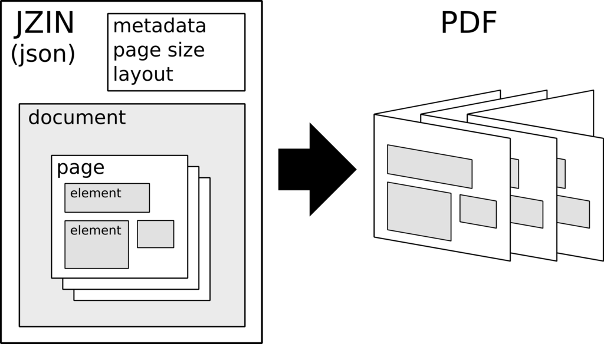

# jzin

**jzin** is ultimately a script to convert specially-formatted JSON into a PDF.  Specifically, these PDFs are expected to be used
to print as books, small booklets, zines, etc.   As such, it also handles complex layout and page ordering in order to facilitate
concepts like N-up printing, signatures, and so on.

## jzin2pdf

This is the main script which generates the PDF based on the [jzin JSON file](docs/jzin.md).
It does this with the powerful perl module [PDF::API2](https://metacpan.org/pod/PDF::API2).

## jzinDesigner

This is a web app used to manipulate jzin files via a simple user interface.

## Generators

The [generators](generators/) directory contains tools to create jzin from various sources of data, such as social media feeds, etc.

### More info

Information and demonstrations can be found at [jzin.org](https://jzin.org).

---------------------

### To-Do: pre-launch

* Instagram import
* ~~Strip newlines from text~~
* Gutters
* ~~Better text UI~~
  * Deprecate overflow/wrap for now (?)
* ~~Image UI~~
  * Better image options (fitInto etc)
* Add/Remove elements on page
  * Expand undo buffer
* Book signatures (hopefully)
* Bug squashing
* ~~Web presence (minimal)~~

### To-Do: future wishlist

* Add images (url, upload, paste) 
* Add fonts (url, upload)
* SVG support
* Mixed fonts/weight/etc
  * Markdown support
  * Emoji
* Twitter import
* Halftoning of images
* TOC into PDF
* Web presence - expanded
* Graphic support (lines, circles, etc.)
* Rotation

